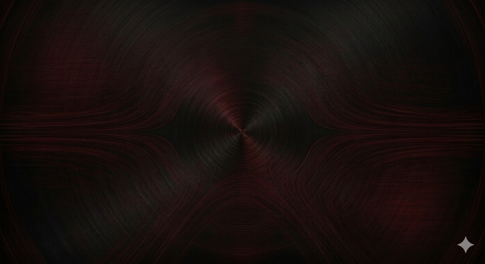

<p align="center">
  
</p>

<h1 align="center">SimpleDynamicEQ</h1>
<p align="center">
  <b>Equalizador paramétrico de 24 bandas com EQ dinâmico, analyzer e processamento Mid/Side</b><br/>
  VST3 &amp; Standalone · Windows 64-bit · Feito com JUCE &amp; C++17
</p>

<p align="center">
  <a href="https://github.com/Adoregabriel2005/SimpleDynamicEQ/releases/latest">
    
  </a>
  
  
  
</p>

---

## Sobre

**SimpleDynamicEQ** (anteriormente ProEQ) é um equalizador VST3 profissional desenvolvido em C++ com [JUCE](https://juce.com/), inspirado no FabFilter Pro-Q 3. Funciona no **FL Studio**, **Ableton Live**, **Reaper** e qualquer DAW compatível com VST3.

Desenvolvido por **GoriSound**.

---

## Funcionalidades

| Feature | Detalhe |
|---|---|
| **24 bandas simultâneas** | Cada banda com parâmetros independentes |
| **Tipos de filtro** | Bell, Low/High Shelf, Low/High Cut (até 48 dB/oct), Notch, Band Pass, All Pass |
| **Dynamic EQ** | Threshold, range, attack/release por banda com redução visual na curva |
| **Mid/Side processing** | EQ em Stereo, Mid, Side, Left ou Right independentemente |
| **3 modos de fase** | Zero Latency (IIR), Natural Phase, Linear Phase (FIR 4096 taps) |
| **Modelos analógicos** | Clean, SSL, Neve, Pultec, API, Sontec |
| **Analyzer FFT** | Espectro em tempo real com peak hold |
| **Detector de problemas** | Identifica ressonâncias e clipping automaticamente |
| **12 presets boom-bap** | 5 categorias prontas pra usar |
| **Q de 0.025 a 40** | Corte cirúrgico ou amplo |
| **Ganho ±30 dB** | Alta precisão floating-point 64-bit |
| **Output Gain** | Compensação de nível global |
| **File Player (Standalone)** | Load, Play e Loop de arquivos de áudio |

---

## Download

Acesse a página de [**Releases**](https://github.com/Adoregabriel2005/SimpleDynamicEQ/releases) e baixe o `.zip` da versão mais recente.

Cada release contém:
- `Standalone/` — executável que roda sozinho, sem DAW
- `VST3/` — plugin para usar na sua DAW

---

## Instalação

### Standalone (sem DAW)

1. Extraia o `.zip` da release
2. Abra a pasta `Standalone/`
3. Execute `ProEQ.exe` (ou `SimpleDynamicEQ.exe`)
4. Use o **File Player** integrado para carregar um áudio (WAV, MP3, FLAC...)
5. Ajuste o EQ em tempo real enquanto ouve

> **Dica:** No Standalone você pode rotular/etiquetar o som — basta carregar o arquivo, aplicar o EQ, e exportar ou monitorar em tempo real.

### VST3 (FL Studio, Ableton, Reaper, etc.)

1. Extraia o `.zip` da release
2. Copie a pasta `.vst3` (dentro de `VST3/`) para:
   ```
   C:\Program Files\Common Files\VST3\
   ```
3. Abra sua DAW e faça um scan de plugins (se necessário)
4. Adicione o plugin:
   - **FL Studio:** Mixer → clique num slot vazio → selecione SimpleDynamicEQ
   - **Ableton Live:** Plugins → VST3 → SimpleDynamicEQ → arraste pro canal
   - **Reaper:** FX → Add → VST3: SimpleDynamicEQ

---

## Como Usar

### Controles Básicos

| Ação | Resultado |
|---|---|
| **Arrastar bolinha horizontalmente** | Altera a frequência da banda |
| **Arrastar bolinha verticalmente** | Altera o ganho da banda |
| **Scroll do mouse na bolinha** | Ajusta o Q (largura) |
| **Alt + Scroll na bolinha** | Ajusta a faixa dinâmica |
| **Duplo-clique na bolinha** | Reset do ganho para 0 dB |
| **Clique direito na bolinha** | Solo, Tornar Dinâmico, Deletar Banda |
| **Botões 1–24** | Seleciona a banda ativa no painel inferior |

### Interface

- **Curva laranja** = resposta combinada de todas as bandas
- **Pontos coloridos** = handles arrastáveis (um por banda ativada)
- **Setas na curva** = redução/aumento dinâmico em tempo real
- **Espectro azul** = analyzer FFT (pré ou pós EQ)
- **Botão "Pre"** = alterna analyzer antes/depois do EQ
- **Botão "Mono"** = soma mono para checar problemas de fase

### Dicas de Uso na DAW

- Insira no **canal master** para ajustes globais de mix
- Insira em **canais individuais** para esculpir instrumentos
- Use **Mid/Side** para alargar o estéreo cortando graves no Side
- Ative o **Dynamic EQ** para controlar ressonâncias sem afetar o timbre geral
- Use os **presets boom-bap** como ponto de partida e ajuste a gosto

---

## Compilar do Código-Fonte

### Pré-requisitos

| Ferramenta | Versão mínima |
|---|---|
| CMake | 3.22 |
| Visual Studio | 2022 (com C++ desktop workload) |
| Ninja | recomendado |
| JUCE | incluído no repositório |

### Build

```powershell
# Clone o repositório
git clone https://github.com/Adoregabriel2005/SimpleDynamicEQ.git
cd SimpleDynamicEQ

# Configure e compile (Release)
cmake -B build -G "Ninja" -DCMAKE_BUILD_TYPE=Release
cmake --build build --config Release
```

O plugin compilado fica em:
```
build/ProEQ_artefacts/Release/VST3/ProEQ.vst3
build/ProEQ_artefacts/Release/Standalone/ProEQ.exe
```

---

## Estrutura do Projeto

```
SimpleDynamicEQ/
├── CMakeLists.txt              # Build system
├── resources/
│   └── background.png          # Background da interface
├── src/
│   ├── PluginProcessor.h/.cpp  # Core DSP + AudioProcessorValueTreeState
│   ├── PluginEditor.h/.cpp     # Janela principal
│   ├── DSP/
│   │   ├── BiquadFilter.h/.cpp        # Filtro biquad Direct Form II
│   │   ├── EQBand.h/.cpp              # Banda com todos os tipos de filtro
│   │   ├── DynamicEQ.h/.cpp           # Detector de envelope para Dynamic EQ
│   │   ├── MidSideProcessor.h/.cpp    # Encode/Decode Mid/Side
│   │   ├── LinearPhaseEQ.h/.cpp       # FIR overlap-add (4096 taps)
│   │   ├── SpectrumAnalyzer.h/.cpp    # FFT em tempo real
│   │   └── FrequencyProblemDetector.h/.cpp  # Detecção de ressonâncias
│   └── GUI/
│       ├── EQCurveComponent.h/.cpp    # Curva EQ + grid + analyzer
│       ├── BandHandle.h/.cpp          # Pontos arrastáveis na curva
│       ├── AnalyzerComponent.h/.cpp   # Visualizador FFT
│       ├── BandControlPanel.h/.cpp    # Painel de controle da banda
│       ├── KnobLookAndFeel.h/.cpp     # Estilo visual dos knobs
│       ├── AudioFilePlayer.h/.cpp     # Player de áudio (Standalone)
│       ├── FactoryPresets.h           # Presets de fábrica
│       └── ProEQColors.h             # Paleta de cores
└── JUCE/                              # Framework JUCE
```

---

## Arquitetura DSP

### Filtros IIR (Zero Latency / Natural Phase)
Biquads Direct Form II Transposed baseados no *Audio EQ Cookbook* de Robert Bristow-Johnson:

$$H(z) = \frac{b_0 + b_1 z^{-1} + b_2 z^{-2}}{1 + a_1 z^{-1} + a_2 z^{-2}}$$

Filtros de corte de alta ordem usam cascata de seções de 2ª ordem com polos Butterworth.

### Linear Phase (FIR)
Kernel FIR gerado por amostragem da resposta de magnitude → IDFT → janela de Blackman → convolução overlap-add com FFT.
**Latência:** 4096 amostras (reportada ao host para compensação automática).

### Dynamic EQ
Seguidor de envelope de pico com attack/release independente. Quando o envelope supera o threshold, o ganho da banda é reduzido proporcionalmente.

### Mid/Side
$$M = \frac{L + R}{2}, \quad S = \frac{L - R}{2}$$

---

## Changelog

Veja o histórico completo em [Releases](https://github.com/Adoregabriel2005/SimpleDynamicEQ/releases).

### v1.2 — SimpleDynamicEQ Beta
- Clique direito na banda: Solo, Tornar Dinâmico, Deletar
- Alt + scroll para ajustar faixa dinâmica
- Anel visual de faixa dinâmica no knob de Gain
- Setas visuais de EQ dinâmico na curva
- Renomeado para SimpleDynamicEQ

### v1.1
- Corrigido crash ao abrir (standalone e VST3)
- Corrigido FL Studio travando ao carregar
- Corrigido Dynamic EQ com modelos analógicos
- Layout do header reorganizado
- 8 bandas ativas por padrão

### v1.0
- Release inicial com 24 bandas, analyzer, Dynamic EQ, Mid/Side, Linear Phase
- 12 presets boom-bap, file player, detector de problemas

---

## Licença

Este projeto é licenciado sob a **GPLv3** (por conta da dependência do JUCE).

---

<p align="center">
  Feito com ❤️ por <b>GoriSound</b>
</p>
